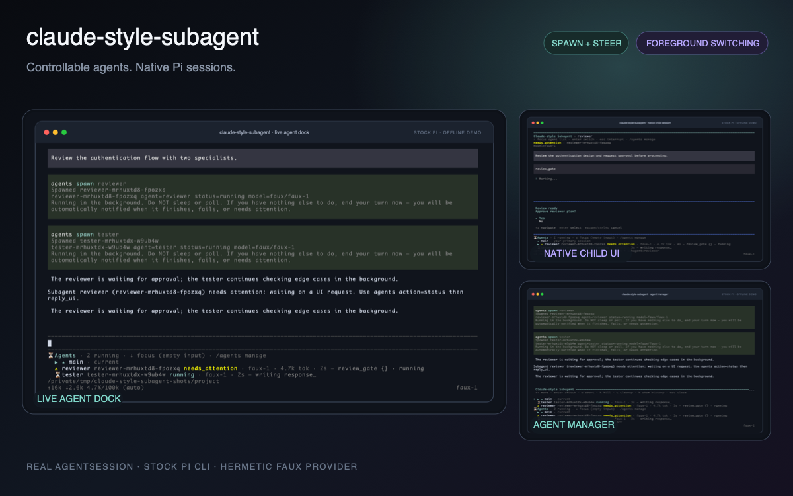
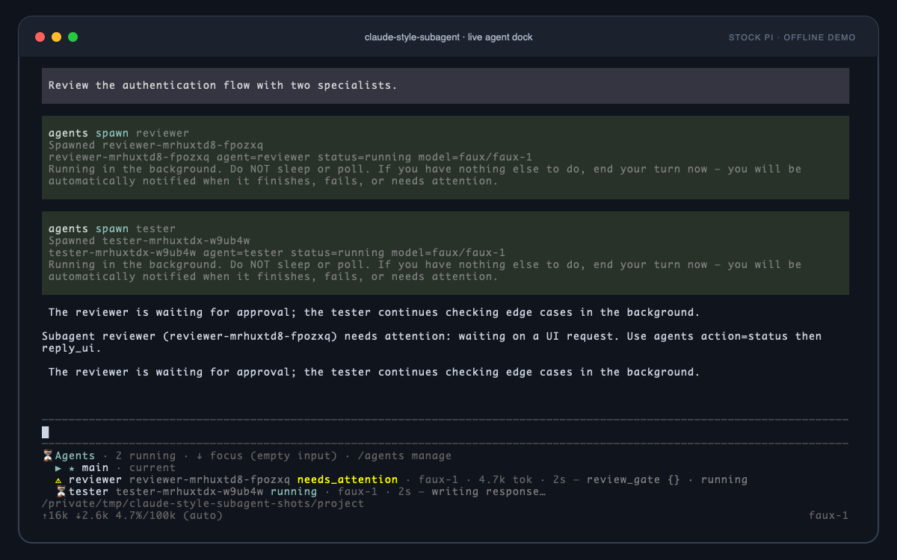
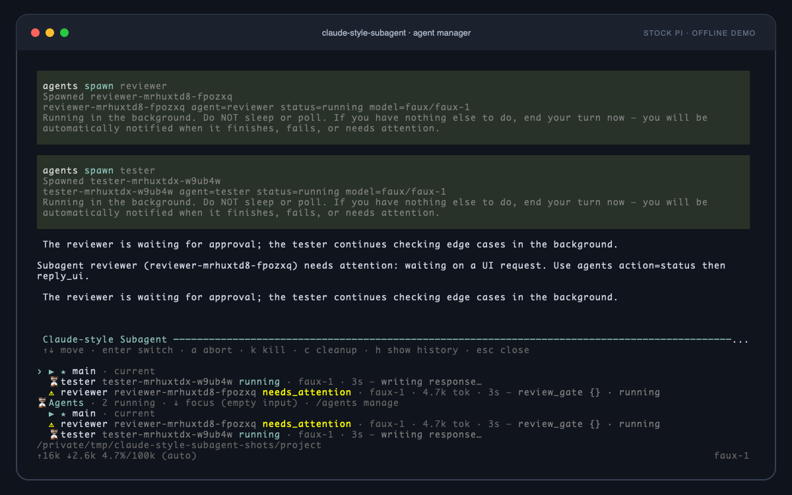
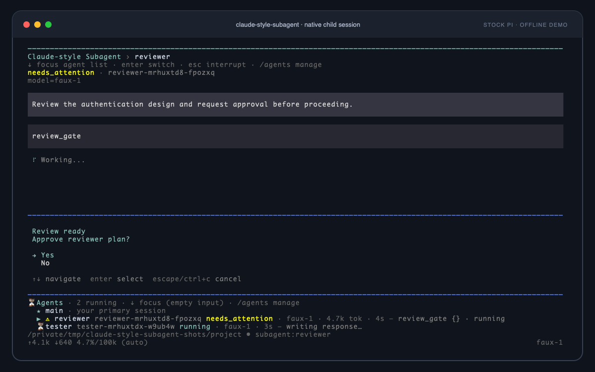

# claude-style-subagent

`claude-style-subagent` is a Pi extension package for long-lived, controllable subagents. It gives the model an `agents` tool, keeps child Pi sessions available across turns, renders a live agent dock, and lets you switch the terminal into a child session without replacing Pi's native conversation UI.

Each child is a real in-process Pi `AgentSession`: it owns its model calls, tools, retry, compaction, extensions, and session history. The parent owns orchestration—spawn, inspect, steer, foreground, abort, kill, and cleanup.



> This package borrows interaction ideas from Claude Code, but is an independent Pi extension and is not affiliated with or endorsed by Anthropic.

## Install

From npm:

```bash
pi install npm:claude-style-subagent
```

From a local checkout:

```bash
pi install /absolute/path/to/claude-style-subagent
```

For one run without installing:

```bash
pi -e /absolute/path/to/claude-style-subagent
```

Pi packages execute with your local user permissions. Review third-party package source before installing it.

The compatibility suite currently pins Pi `0.80.6`. Other Pi versions are not yet part of the tested compatibility contract because foreground switching uses a narrow runtime patch when stock Pi does not expose the required host seam.

## What it adds

- `agents`, an LLM-callable tool for discovering, spawning, inspecting, steering, and stopping subagents
- `agent_wait`, available only in single-shot `pi -p` and `--mode json` runs
- a persistent **Agents** dock below the editor
- `/agents` for foreground switching and management
- `alt+a` and empty-editor `↓` navigation into the dock
- per-project run metadata and resumable Pi session history
- a bundled read-only `reviewer` agent profile
- project, user, and package agent discovery with explicit precedence

## Quick start

The model normally calls `agents` itself. A typical flow is:

```json
{"action":"list_agents"}
```

```json
{
  "action": "spawn",
  "agent": "reviewer",
  "task": "Review the authentication flow and report concrete issues.",
  "wait": false
}
```

The child continues while the parent remains interactive. When it finishes, fails, or needs a UI answer, the extension notifies the parent immediately. Do not poll it with shell sleeps.

Every invocation of `spawn` creates an independent child Pi session. Follow-up actions address that session by its full id or a unique id prefix.

## TUI workflow

### Monitor subagents without leaving the main conversation

Active runs stay in the dock; completed runs linger for 30 seconds. Elapsed ages update once per second with an ordinary render request rather than a forced full-screen repaint.



With an empty editor, press `↓` or `alt+a` to focus the dock:

| Key | Action |
| --- | --- |
| `↑` / `↓` | Move between `main` and child sessions |
| `Enter` | Put the selected session in the foreground |
| `a` | Abort the selected child's active turn |
| `k` | Kill the selected child session |
| `Esc` / `q` | Return focus to the editor |

### Manage live and persisted runs

Run `/agents` to replace the editor temporarily with the manager.



The manager supports:

| Key | Action |
| --- | --- |
| `↑` / `↓` | Move selection |
| `Enter` | Foreground or revive the selected session |
| `a` | Abort a live turn |
| `k` | Kill a live child |
| `c` | Remove finished runs |
| `h` | Show or hide persisted history |
| `Esc` / `q` | Close the manager |

Use `/agents <id-or-prefix>` to switch directly, or `/agents main` to return to the parent session.

### Work inside the real child session

Foreground switching does not render a copied transcript. It switches Pi's terminal host to the child's real `AgentSession`, including native chat history, streaming output, tools, editor, queueing, and extension dialogs.



Other children keep running in the background while one session owns the terminal.

## `agents` actions

| Action | Purpose |
| --- | --- |
| `list_agents` | Discover package, user, and optionally project agent profiles |
| `spawn` | Create a child session and optionally start its first task |
| `list` | List tracked live and persisted runs |
| `status` | Return one run's current snapshot |
| `transcript` | Return the latest transcript lines |
| `last_output` | Return the latest assistant text |
| `prompt` | Start a fresh turn in a live idle child session |
| `steer` | Steer an active turn; starts a fresh turn when idle |
| `follow_up` | Queue a follow-up behind an active turn; starts a fresh turn when idle |
| `reply_ui` | Answer a pending child `confirm`, `select`, `input`, or `editor` request |
| `abort` | Cancel the active child turn but keep the session |
| `kill` | Dispose the child session |
| `cleanup` | Remove finished runs from the registry and dock |

Common spawn controls:

```json
{
  "action": "spawn",
  "agent": "reviewer",
  "task": "Review the current implementation.",
  "cwd": "/path/to/project",
  "model": "provider/model-id",
  "thinking": "high",
  "allowTools": ["read", "grep", "find", "ls"],
  "denyTools": ["bash"],
  "wait": false,
  "maxDepth": 1
}
```

Additional controls include `extensions`, `inheritExtensions`, `noExtensions`, `name`, `sessionDir`, `noSession`, `agentScope`, `waitSeconds`, and `lines`. The legacy `tools` field remains an exact allowlist override and takes precedence over `allowTools`.

## Agent profiles

Profiles are Markdown files with frontmatter:

```markdown
---
name: reviewer
description: Read-only review focused on correctness and maintainability.
tools: read, grep, find, ls
model: anthropic/claude-sonnet-4-5
thinking: low
---

Review the requested code and return concise findings with file evidence.
```

Only `name` and `description` are required. Omitting `model`, `thinking`, or `tools` lets normal Pi configuration supply them.

The extension discovers profiles from these locations, with later entries overriding earlier entries of the same name:

1. package: `agents/*.md`
2. user: `~/.pi/agent/agents/*.md`
3. project: nearest `.pi/agents/*.md`, when `agentScope` is `project` or `both`

`agentScope` defaults to `user`, which includes package and user profiles but not project-controlled profiles. Project profiles remain subject to Pi project trust and are not discovered or runnable until the project is trusted, including in non-interactive modes.

## Child resources and extensions

A child resolves Pi resources for its own `cwd`. By default it also inherits explicit parent `--extension` / `-e` flags and the parent's `--no-extensions` state.

- `extensions`: add extension paths for the child; relative paths resolve from the child's `cwd`
- `inheritExtensions: false`: do not inherit explicit parent extension flags
- `noExtensions: true`: disable normal extension auto-discovery for the child
- `allowTools` / `denyTools`: narrow the child's tool set
- `noSession: true`: use an in-memory child session instead of a persisted session file

The default recursion limit is `maxDepth: 1`, so a child cannot silently create grandchildren. Increase it only when nested delegation is intentional.

## Background execution and waiting

“Background” means non-blocking inside the current Pi process. It does **not** mean a detached operating-system process.

### Interactive TUI sessions

`spawn` defaults to `wait:false`. The child runs on the parent's event loop and remains available across user turns. A notable state change—completion, failure, or pending UI—uses `triggerTurn` to steer the current parent turn or wake a new one.

`agent_wait` is intentionally not registered in interactive mode. If no independent work remains after a background spawn, end the turn; do not sleep or poll.

### Single-shot runs

`pi -p` and `--mode json` exit after their one parent turn. In these modes the extension registers `agent_wait` so the turn can remain alive long enough for in-process children to finish:

```json
{}                       // return when the first active run finishes
{"all":true}             // return when every active run finishes
{"id":"reviewer-"}      // wait for one id or unique prefix
{"timeoutMs":600000}     // stop waiting after 10 minutes; children keep running
```

A pending child UI request also ends the wait so the caller can inspect it with `status` and answer with `reply_ui`.

## Child UI requests

When a background child extension calls `confirm`, `select`, `input`, or `editor`, the run enters `needs_attention` instead of blocking invisibly.

Inspect and answer it programmatically:

```json
{"action":"status","id":"reviewer-"}
```

```json
{
  "action": "reply_ui",
  "id": "reviewer-",
  "requestId": "reviewer-...-ui-...",
  "value": true
}
```

Alternatively, foreground the child. Pending standard dialogs are replayed through Pi's native UI. Arbitrary `custom` UI cannot be replayed and must be handled through `reply_ui` when the child exposes a compatible value contract.

## Persistence

The registry writes lightweight per-project metadata under Pi's agent configuration directory. Full conversations remain in Pi session files; the registry does not duplicate transcript history.

A killed or restored history row with a valid session file can be revived under the same run id and receive new turns. Running children are still in-process: parent session shutdown stops them, and active execution is not resumed automatically after restarting Pi.

## Boundaries

`claude-style-subagent` does not:

- create detached workers that survive the parent Pi process
- run multiple terminal owners at once
- isolate child file edits in worktrees
- bypass Pi project trust or tool permissions
- guarantee runtime-patch compatibility with untested Pi releases

The package keeps legacy internal message, persistence, and runtime-patch identifiers so existing history remains readable across the package rename.

## Development checks

The test stack is hermetic and performs no model-network calls:

1. real `AgentSession` runtimes driven by Pi's Faux Provider
2. real `InteractiveMode` rendered into an xterm-headless virtual terminal
3. a real stock Pi CLI subprocess that verifies the runtime patch and child execution end to end

Run the release gate:

```bash
npm ci --ignore-scripts
npm run gate
npm run test:coverage
```

Individual layers:

```bash
npm run test:core
npm run test:tui
npm run test:cli
```

`npm run gate` typechecks source, runs the no-network test suite, and performs an npm package dry-run. The published package is limited to `README.md`, `CHANGELOG.md`, `assets/`, `agents/`, and `extensions/`; tests, local Pi configuration, prototypes, prompts, and development runtime files are excluded.
